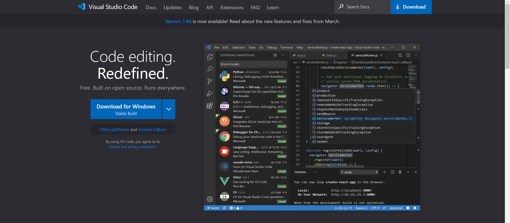
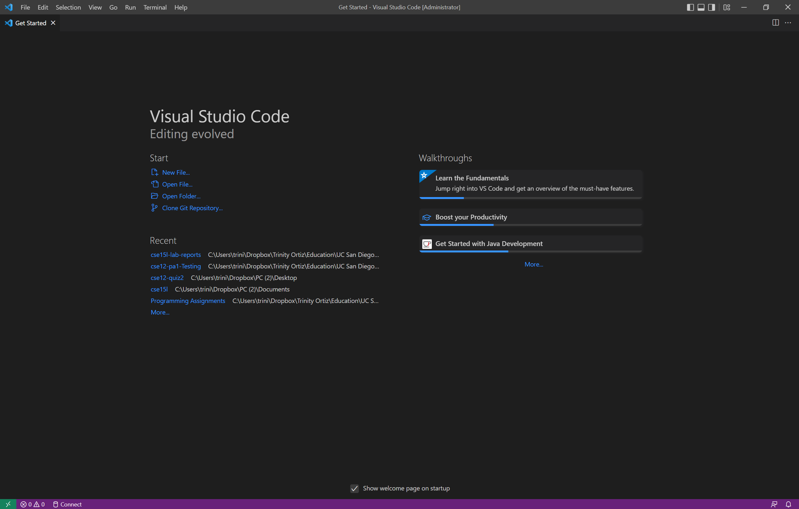

**Lab Report #1: Logging Into UCSD Servers**
=============
Some coding projects require the use of a UNIX or LINUX system. For the Windows OS system, we must login to the UCSD remote server to run our programs since the server uses a LINUX based system. 

To start running your programs with ease on a linux operating system using your own personal console, you must do the following:

1. **Install Visual Studio Code**
    - To download VS Code go to the [VS Code Dowload Page](https://code.visualstudio.com/)  
        - Click on the "Download for Windows" button to download and install VS Code onto your local computer
    
    - Once you have installed VS Code, you should see a screen similar to this &darr; (NOTE: Your screen will look different!)
    
2. **Connect to the UCSD Server**  
In the UCSD CSE courses, you may be given a specific course account which are similar to accounts that you may given in your future career. For Windows users, we need to take one extra step before we attempt to connect to the servers.   
    - [Install OpenSSH](https://docs.microsoft.com/en-us/windows-server/administration/openssh/openssh_install_firstuse)
    - Find your course-specific account [here](https://sdacs.ucsd.edu/~icc/index.php) and take note of what your password is.
        - If you don't know your password, reset it using your UCSD credentials. It may take a few minutes to an hour for the system to update your password.
    

- Trying Commands
- Moving Files using scp command
- Setting an SSH Key
- Optimizing Remote Running

