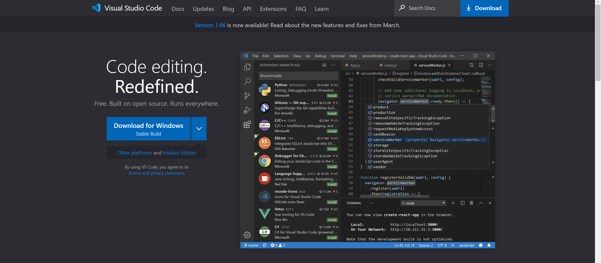

**Lab Report #1: Logging Into UCSD Servers**
=============
Some coding projects require the use of a UNIX or LINUX system. For the Windows OS system, we must login to the UCSD remote server to run our programs since the server uses a LINUX based system. 

To start running your programs with ease on a linux operating system using your own personal console, you must do the following:

1. Install Visual Studio Code   
    - To download VS Code go to the [VS Code Dowload Page](https://code.visualstudio.com/)  
        - Click on the "Download for Windows" button and follow the directions to install the installer
    
    

- Remotely Connecting
- Trying Commands
- Moving Files using scp command
- Setting an SSH Key
- Optimizing Remote Running

